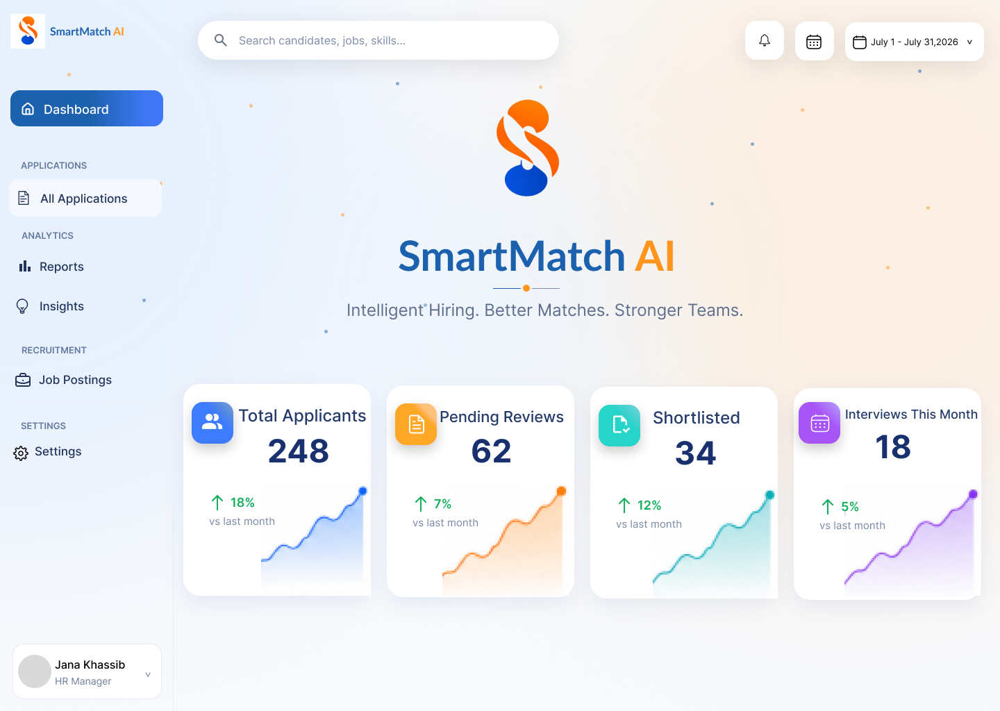
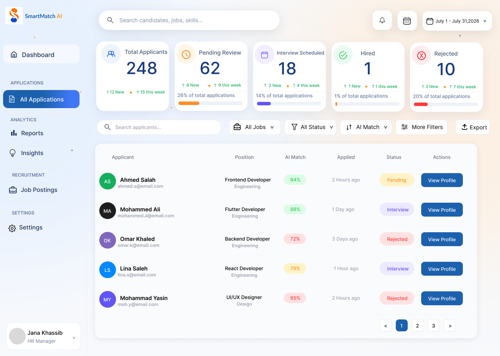
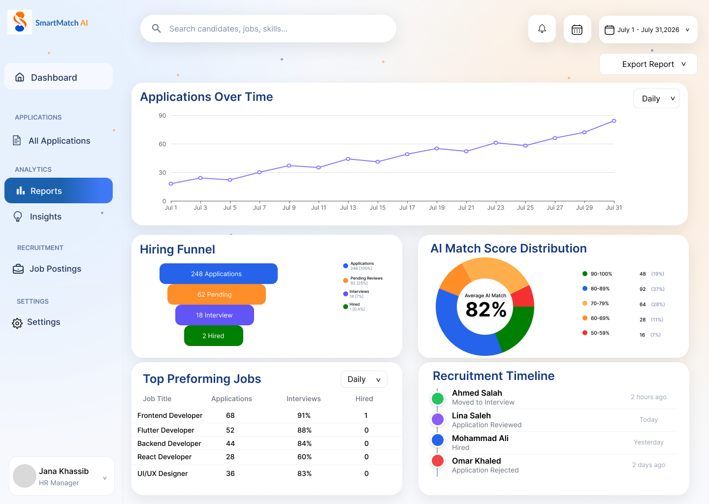

# SmartMatch AI

SmartMatch AI is an HR recruitment dashboard designed to help recruitment teams organize applications, manage job postings, review candidate information, and work with AI-assisted candidate matching.

## Project overview

SmartMatch AI was developed during my software development internship at Integrated Technology Group (ITG).

The project focused on creating a structured recruitment experience for HR teams and system administrators, bringing applications, job postings, reports, insights, settings, and candidate matching into one dashboard.

## My role

I contributed to the UI/UX design and frontend implementation of the HR and system administration interfaces.

My work included:

- Designing dashboard experiences in Figma
- Implementing frontend interfaces with React
- Creating reusable UI patterns for cards, navigation, forms, tables, and dashboard components
- Building application management interfaces
- Designing reports and recruitment insights
- Working on job posting and job creation workflows
- Designing AI matching preferences
- Creating integrations, security, and settings interfaces
- Maintaining visual consistency across the platform

## Timeline and team

- Timeline: 2026
- Project type: Software Development Internship Project
- Organization: Integrated Technology Group (ITG)
- Team: 5 people

## Problem

Recruitment teams often work across multiple tools to manage applications, job postings, reports, and candidate information.

SmartMatch AI brings these activities together in one organized interface and helps HR users review recruitment information more clearly.

## Process

I began by understanding the recruitment workflow and identifying the information HR users needed to access quickly.

The main workflows included:

- Reviewing the recruitment dashboard
- Browsing and managing applications
- Reviewing candidate information and matching results
- Managing job postings
- Creating new job postings
- Viewing recruitment reports and insights
- Configuring recruitment and system settings

I designed the interfaces in Figma and established reusable visual patterns to keep the experience consistent across the dashboard.

After the design stage, I translated the approved designs into frontend interfaces using React, JavaScript, HTML, and CSS. The interfaces were refined according to project requirements and feedback received during the internship.

## Selected screens

### HR dashboard

The main overview for recruitment activity, applications, and candidate information.

### Application management

An interface for reviewing and organizing candidate applications.

### Recruitment reports

A reporting view for presenting recruitment data and insights.

## Technologies

- React
- JavaScript
- HTML
- CSS
- Figma
- Git
- GitHub

## Biggest challenge

One of the main challenges was presenting a large amount of recruitment and candidate information without overwhelming the HR user.

The interface needed to make complex information easy to scan while remaining consistent across dashboards, tables, forms, settings, and workflows.

## Outcome

SmartMatch AI provided a structured HR recruitment dashboard for managing applications, job postings, reports, insights, settings, and AI-assisted candidate matching.

The project gave me practical experience moving from UI/UX design into frontend implementation across a multi-screen software product.

## Project availability

The source code is private.

The screens shown in this repository are selected project designs and interfaces. There is no public live demo because the project was developed during my internship at ITG.
